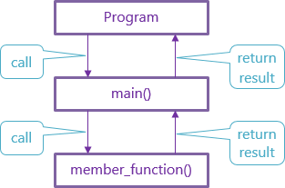

# Exception Handling - Xử lý ngoại lệ

## 1 Tổng quan

Exception (ngoại lệ) là cơ chế thông báo và xử lý những vấn đề tiềm ẩn phát sinh (giống như lỗi runtime) trong chương trình bằng cách chuyển quyền điều khiển đến những hàm đặc biệt nhằm tách phần xử lý lỗi ra khỏi thuật toán chính.

Một ngoại lệ là một đối tượng chứa thông tin về lỗi và truyền thông tin của lỗi cho bộ phận xử lý để có những hướng giải quyết phù hợp.

Ngoại lệ có thể thuộc bất kì kiểu dữ liệu bất kỳ của C++:

* Có sẵn như `int`, `char`, `int*` , `char*`, …
* Kiểu người dùng tự định nghĩa
* Các lớp ngoại lệ trong thư viện `<exception>`

## 2 Cơ chế của ngoại lệ

### 2.1 Cơ chế

Quy trình gọi hàm và trả về trong trường hợp bình thường:



Quy trình ném và bắt ngoại lệ tại `member_function()`:


Cơ chế xử lý ngoại lệ của C++ có 3 tính năng chính:

* Khả năng tạo và ném ngoại lệ (sử dụng từ khóa `throw`).
* Khả năng bắt và giải quyết ngoại lệ (sử dụng từ khóa `catch`).
* Khả năng tách phần xử lý ngoại lệ ra khỏi phần có thể sinh lỗi (sử dụng từ khóa `try`).

### 2.1 Hướng giải quyết

Muốn bắt exception tại vị trí nào của chương trình thì ta phải đặt tại đó 1 đoạn code nhằm kiểm tra ngoại lệ. Đoạn chương trình này được đóng gói trong 1 khối try-block. Khi một ngữ cảnh thực thi tiếp nhận và truy nhập một ngoại lệ được coi là bắt ngoại lệ (catch the exception) thì nó được truyền đến phần xử lý ngoại lệ (exception handler). Song, nếu không xảy ra bất cứ ngoại lệ nào thì chương trình được build bình thường và các bộ xử lý đều được bỏ qua.

Và quá trình truyền ngoại lệ từ ngữ cảnh thực thi hiện hành đến mức thực thi cao hơn - được gọi là ném 1 ngoại lệ (throw an exception) – bằng cách sử dụng từ khóa throw. Phần xử lý ngoại lệ được khai báo trong từ khóa catch dùng để xử lý ngay khi sau try-block.

Ví dụ đoạn chương trình ném 1 ngoại lệ:

```c++
// Exceptions
#include <iostream>
#include <string>
using namespace std;

int main()
{
    try
    {
        throw string("String!");
    }
    catch (string e)
    {
        cout << "An exception occurred. Exception: " << e << endl;
    }
    catch(...)
    {
        cout << "An exception occurred." << endl;
    }
    return 0;
}
```

Đoạn code dưới xử lý ngoại lệ bên trong khối lệnh try.

```c++
throw string("String!");
```

Biểu thức ném ngoại lệ chấp nhận 1 tham số (trong trường hợp này là 1 chuỗi kí tự “String!”) được thông qua để xử lý ngoại lệ.

Đoạn xử lý ngoại lệ được khai báo vời từ khóa `catch` ngay sau kết thúc khối `try`. Cú pháp bắt ngoại lệ cũng tương tự như khai báo 1 hàm thông thường với 1 tham số. Loại tham số truyền vào `catch` rất quan trọng vì các loại của đối số này thông qua biểu thức ném để kiểm tra và chỉ khi phù hợp thì các ngoại lệ được bắt mới được xử lý.

Khi ngoại lệ được ném đi, hệ thống xử lý ngoại lệ sẽ kiểm tra các kiểu được liệt kê trong khối catch theo thứ tự liệt kê:

* Khi tìm thấy kiểu đã khớp, ngoại lệ được coi là được giải quyết, không cần tiếp tục tìm kiếm.
* Nếu không tìm thấy, mức thực thi hiện hành bị kết thúc, ngoại lệ được chuyển lên mức cao hơn.

Do khó có thế kiểm soát mọi trường hợp xảy ra trong chương trình và để mức thực thi hiện hành không bị kết thúc giữa chừng ta có thể sử dụng dấu “…” làm đối số truyền vào catch, phần xử lý này sẽ bắt bất kỳ ngoại lệ nào được ném (bao gồm cả những ngoại lệ không thể giải quyết).
